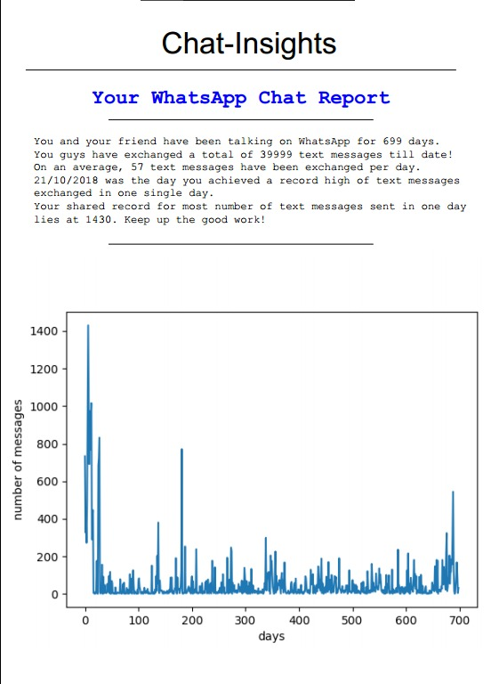
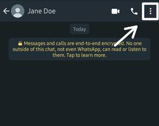
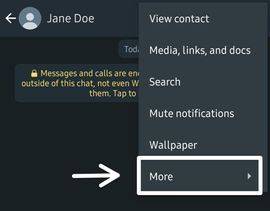
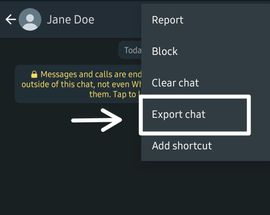

# Chat-Insights
## Generate a PDF report 📝and gain interesting insights 🧐 about your WhatsApp chat with your best buddy!  
  


  

# Installation
```pip install -r requirements.txt```


# Further steps
- Export your WhatsApp chat and place the file in the same directory as this project. Follow the steps below to export your chat.  
  
## Step 1  

  
  
## Step 2  
  
  
## Step 3  
  
  
  
# Step 4  
   
  

After exporting the chat, make sure that you have the WhatsApp chat file in the same directory. 


